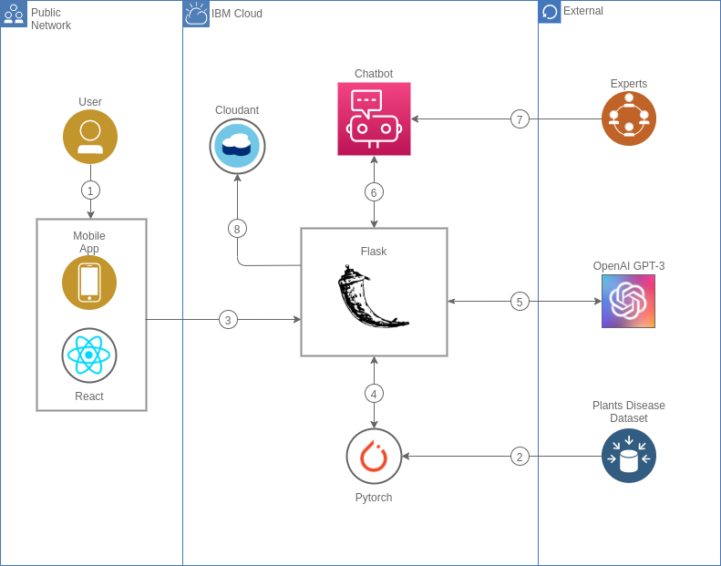

# CHATBIO

## Problematica

  - Desconocimiento de enfermedades en plantas
  - Variaciones climaticas y geograficas
  - Tratamientos con productos químicos

## Beneficios

- Conocimiento sobre agronomía
- Consumo organico
- Medio ambiente 

## Propuesta

